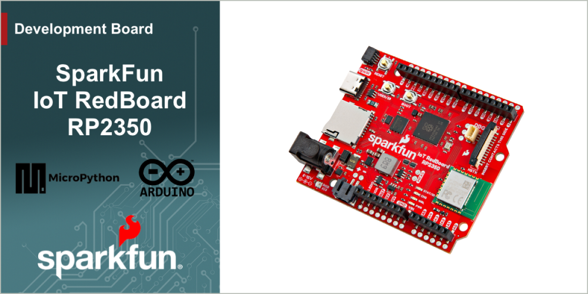

[*SparkFun IoT RedBoard - RP2350 (WRL-27708)*](https://www.sparkfun.com/sparkfun-iot-redboard-rp2350.html)

The SparkFun IoT Redboard - RP2350 combines the RP2350 microcontroller with the Raspberry Pi Radio Module 2 to provide a powerful and versatile wireless development platform in the Arduino R4 form factor. This IoT Redboard also includes integrated battery power and charging circuits, &micro;SD card slot, Qwiic connector, 3-pin debug header as well as a 22-pin ribbon cable connector tied to the RP2350's HSTX (high-speed transmit) pins. The board shares a pinout between female headers and matching 0.1"-spaced plated through-hole (PTH) headers to allow you to choose between temporary or soldered connections. 

Repository Contents
-------------------

* **/Documentation** - Data sheets, additional product information
* **/Examples** - Example code
* **/Hardware** - Eagle design files (.brd, .sch)
* **/docs** - GitHub Pages documentation files

Documentation
--------------

* **[Hookup Guide](https://docs.sparkfun.com/SparkFun_IoT_RedBoard-RP2350/)** - Basic hookup guide for the SparkFun IoT RedBoard - RP2350.

Product Versions
----------------

* [WRL-27708](https://www.sparkfun.com/sparkfun-iot-redboard-rp2350.html) - Initial release of the IoT RedBoard - RP2350

License Information
-------------------

This product is ***open source***!

Please review the LICENSE.md file for license information.

If you have any questions or concerns on licensing, please contact technical support on our [SparkFun forums](https://forum.sparkfun.com/viewforum.php?f=152).

Distributed as-is; no warranty is given.

* Your friends at SparkFun.
