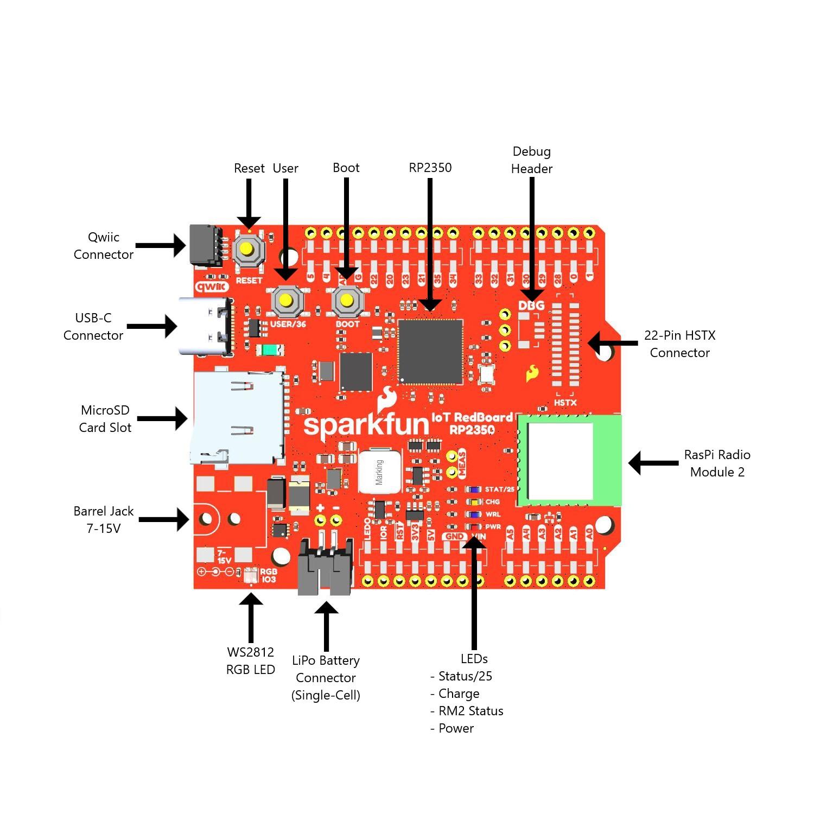

This document gives a detailed overview of the RedBoard IoT - RP2350 and all components present on the board.

## IoT RedBoard - RP2350 Overview

The IoT RedBoard - RP2350 is packed with hardware aimed at helping users get the most out of the RP2350. This includes multiple power inputs like USB-C and a 2-pin JST connector, Qwiic connector, standard R3 female headers, several status LEDs and also a couple specialized headers for the RP2350's high-speed transmit (HSTX) pins and its debug pins. The photo below highlights all the major components on this board that we'll cover in this Hardware Overview.

[{ width="600"}](./assets/img/SparkFun_IoT_RedBoard-RP2350-Labels.jpg "Click to enlarge")

## RP2350 Microcontroller

The RP2350 from Raspberry Pi packs a whole lot of computing punch in a tiny package. The RP2350 is a unique dual-core microcontroller that has <i>four</i> internal processors (two Arm Cortex-M33 and two Hazard3 RISC-V processors @150 MHz), though you can only select any two of these four to run at the same time. 

This internal configuration allows users to customize the chip to use a pair their preferred architecture (ARM or Hazard3) or to use one of each! The RP2350 includes 520kB of on-chip SRAM in ten independent banks, 8kB of one-time-programmable (OTP) storage and this board also includes PSRAM connected to the chip's QSPI bus. The RP2350 also has a bevy of security features including optional boot signing with protected OTP storage for the boot decryption key, global bus filtering (based on either Arm or RISC-V security and privilege levels) and more.

The RedBoard IoT - RP2350 uses the "A" version of the microcontroller which has 30 5V-tolerant GPIO with 4 analog inputs and also includes the following peripheral options:

* 2x UART
* 2x SPI
* 2x I2C
* 24 PWM
* USB 1.1 Controller
* 12 PIO State Machines
* 1x High-Speed Transmit (HSTX) Peripheral for DVI/DSI support

For complete information on the RP2350, refer to the [datasheet](./assets/component_documentation/rp2350-datasheet.pdf).

## Memory

### W25Q128 Flash

The W25Q128 Flash IC adds 16MB of storage space on the RedBoard IoT. This connects to the RP2350 over QSPI.

### PSRAM

The board also includes an 8MB PSRAM IC for dynamic storage. This also connects to the RP2350 over QSPI. PSRAM support is included in the SparkFun MicroPython "early release" firmware found later in this guide and on the product page, but is not natively supported in the Pico SDK as of release. Refer to the Arducam Demo section of this guide for information on how to enable and set up PSRAM using the Pico SDK.

For a complete overview of the PSRAM IC, refer to the [datasheet](./assets/component_documentation/APS6404L_3SQR_Datasheet.pdf).

### &micro;SD Card Slot

The board has a &micro;SD card slot that connects to the RP2350's SPI bus for even more storage. Make sure the SPI are **LOW** when the &micro;SD card is **unpowered**. Setting these pins **HIGH** can damage the GPIO pins. The connector is a fricton-fit connector so no "clicking" and "unclicking" is necessary. Just plug it in nice and snug. 

## Raspberry Pi RM2 Radio Module

The Raspberry Pi RM2 (radio module 2) is built around the same chipset as the previous Raspberry Pi radio module found on boards like the Pico W. The module features both WiFi 4 (802.11n) 2.4GHz and  Bluetooth&trade; 5.2 with support for Low Energy (Central and Peripheral) and Classic. 

The RM2 communicates with the RP2350 over SPI and we've designed this board to use the same pins for the radio module as official Raspberry Pi boards (Pico W and Pico 2 W), making it easy to use the radio module without having to adjust anything from those development boards. The RedBoard IoT routes the module's GPIO0 pin to a blue STAT LED to allow users to create a visual indicator of the status of the module. We added this STAT LED connected to the same pin used on the Pico W to make code for that compatible with the RedBoard IoT - RP2350.

## Power

The RedBoard IoT - RP2350 includes several options for powering including USB-C, LiPo battery with on-board battery charging and monitoring circuits as well as direct power inputs.

### USB-C

The USB-C connector on the board acts as the primary serial interface for the RP2350 as well as a power input. The <b>5V</b> USB input voltage is regulated down to <b>3.3V</b> through a voltage regulator with a max current of <b>500mA@3.3V</b>.

### Barrel Jack

The barrel jack connector on this board accepts a supply voltage between <b>7V</b> and <b>15V</b>. This supply voltage includes a <b>16V/2.5A/5A</b> fuse.

### LiPo Power & Charging

The IoT RedBoard - RP2350 can also be powered with a single cell lithium battery through a 2-pin JST connector. The board also includes a MCP73831 LiPo charge IC as part of a charging circuit for a connected battery. The charge rate is set to <b>455mA</b> and is powered either via USB, barrel jack or dedicated pin. 

It also has a MAX17048 battery fuel gauge to monitor a connected battery's voltage level. The fuel gauge communicates with the RP2350 over I2C.

## Pinout

### R3 Footprint Female Headers

### HSTX Connector

### RP2350 Debug Connector

We've also included a dedicated 1mm 3-pin connector tied to the RP2350's debug pins (SWDIO, SWCK & Ground). Users can plug a [debug cable (link needed - ML)]() to this connector. These pins are also connected to a 0.1"-spaced PTH header right next to it for those who prefer a different connection type. 

## LEDs

This board has four LEDs labeled <b>STAT/25</b>, <b>CHG</b>, <b>WRL</b>, <b>PWR</b> and <b>RGB/IO3</b>.

**Photo highlighting LEDs - ML**

The list below outlines the color and functionality of the LEDs on the IoT RedBoard - RP235.

* <b>STAT/25</b> - Blue LED tied to the RP2350's IO25. User-programmable status LED. 
* <b>CHG</b> - Yellow LED connects to the MCP73831 LiPo charge IC to indicate when an attached battery is being charged.
* <b>WRL</b> - Blue LED tied to IO0 on the RM2. User-programmable status LED.
* <b>PWR</b> - Red LED tied to <b>3.3V</b> power circuit.
* <b>RGB/IO3</b> - WS2812 RGB LED tied to the RP2350's IO3. User-progammable RGB LED.

## Buttons

There are three push buttons on the board labeled <b>RESET</b>, <b>USER/36</b> and <b>BOOT</b>.

**Photo highlighting buttons - ML**

The <b>RESET</b> button connects to the RP2350's RUN pin and resets the RP2350 when pressed. The <b>USER/36</b> button connects to IO36 on the RP2350 and can act as a physical input to trigger an event in code. The <b>BOOT</b> button 

## Solder Jumpers

The IoT RedBoard - RP2350 has five solder jumpers labeled <b>PWR</b>, <b>LP</b>, <b>SHLD</b>, <b>I2C</b> and <b>BYP</b>. 

**Photo highlighting solder jumpers - ML**

The list below outlines the solder jumpers functionality, default state and any notes about their behavior.

* <b>PWR</b> - Completes the Power LED circuit. CLOSED by default. Open to disable the power LED to help conserve power.
* <b>LP</b> - Pulls the RP9080 3.3V regulator's enable (EN) pin HIGH (3.3V) to power the peripheral (3.3V_P) power circuit. CLOSED by default. While enabled, this provides power to the &micro;SD card and RGB LED. Open to disable the peripheral power circuit.
* <b>SHLD</b> - Nets the USB-C Shield pin to the board's ground plane. CLOSED by default. Open to isolate the shield pin from the board's ground.
* <b>I2C</b> - Three-way jumper pulls the I2C pins (IO4/SDA and IO5/SCL) to <b>3.3V</b> through a pair of <b>2.2k&ohm;</b> resistors. CLOSED by default. Open the jumper to disable the pullups on these pins.
* <b>BYP</b> - Fuse bypass jumper. OPEN by default. Close to bypass the fuse on the VIN input.