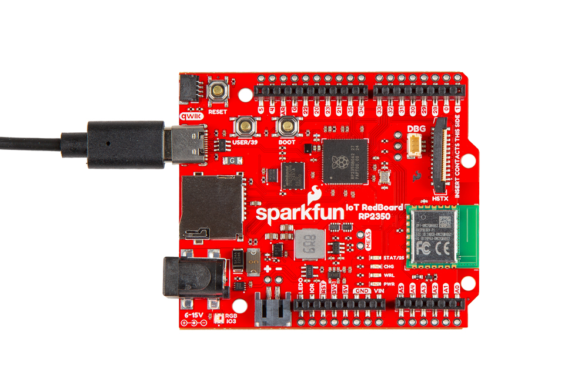
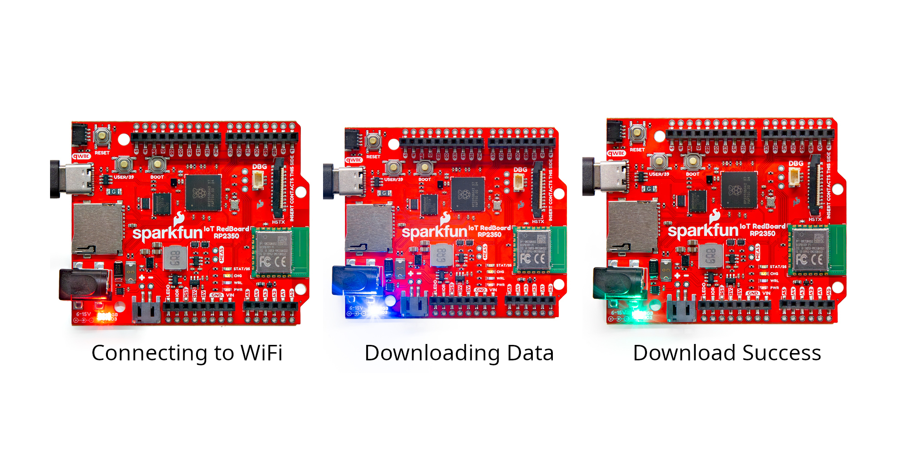

Welcome to the SparkFun IoT RedBoard - RP2350 Quick Start Guide showing how to set up and use the RM2 wireless chip to connect to a WiFi network, request and download data on the number and names of astronauts currently on the International Space Station. If you're not familiar with using development boards or the development environments covered in this guide, refer to the Hardware & Software sections for a detailed overview of the board along with instructions on setting up and programming the IoT RedBoard - RP2350.

## Basic Assembly

Start by plugging the IoT RedBoard - RP2350 into your computer using a USB-C connector. 

[{ width="600" }](./assets/img/SparkFun_IoT_RedBoard-Assembly.jpg "Click to enlarge")

## Code Examples

The following examples for both MicroPython and Arduino can be found in the Examples folder [here](https://github.com/sparkfun/SparkFun_IoT_RedBoard-RP2350/tree/main/Examples) in the GitHub repository. They demonstrate how to connect the IoT RedBoard - RP2350 to a WiFi network and then request and download data on the number of astronauts currently in space. They also include a visual indicator of the connection status using the RGB LED on the board like the photos below show:

[{ width="800"}](./assets/img/SparkFun_IoT_RedBoard-WiFi_Test.jpg)

### MicroPython

The IoT RedBoard - RP2350 ships with MicroPython firmware pre-loaded on the board. If needed, you can find the latest release of the firmware [here](https://github.com/sparkfun/micropython/releases). Open and run the Astronaut Network Demo in MicroPython by following these steps:

* Ensure you have a Python IDE like [Thonny](https://thonny.org/) installed or use a Command Line Interface (CLI) if you prefer.
* Download and open the [Astronaut Network Demo](https://github.com/sparkfun/SparkFun_IoT_RedBoard-RP2350/blob/main/Examples/Astronaut_Network_Demo_mpy/Astronaut_Network_Demo_mpy.py) in your preferred Python IDE (or CLI).
* Adjust values for `WIFI_NETWORK` and `WIFI_PASSWORD` to your network's credentials.
* Run the example.
* Watch the serial print out for status updates along with the RGB cycling from red to blue and then green.

**Code to Note**:

* Required modules for the example:
``` py
import network
import urequests
import time
import neopixel
import machine
```

* LED control. Values are (R,G,B) 0-255. This sets the LED to full Red:
``` py
led[0] = (255, 0, 0)
led.write()
```

* WiFi network connection. Enter values for network ID and password:
```py
wlan = network.WLAN(network.STA_IF)
wlan.active(True)
wlan.connect('WIFI_NETWORK', 'WIFI_PASSWORD')
```
Serial print and download request for the list of astronauts currently in space: 
```py
print('Downloading list of astronauts currently in space...')
astronauts = urequests.get("https://corquaid.github.io/international-space-station-APIs/JSON/people-in-space.json").json()
```

* Serial print of the number of and names of astronauts:
```py
# Print the number of astronauts and their names
number = astronauts['number']
print('There are', number, 'astronauts in space.')
for i in range(number):
    print(i+1, astronauts['people'][i]['name'])
```

### Arduino IDE

Run the Astronaut Network Demo using the [Arduino IDE](https://www.arduino.cc/en/software) by following these steps:

* Download and open the [Astronaut Network Demo](https://github.com/sparkfun/SparkFun_IoT_RedBoard-RP2350/blob/main/Examples/Astronaut_Network_Demo/Astronaut_Network_Demo.ino) sketch in Arduino.
* Open the [Board Manager](https://docs.arduino.cc/software/ide-v2/tutorials/ide-v2-board-manager/) and search for "Arduino Pico" to install the [Arduino-Pico](https://github.com/earlephilhower/arduino-pico) package.
* Open the [Library Manager](https://docs.arduino.cc/software/ide-v2/tutorials/ide-v2-installing-a-library/) and search for "FastLED" to install the [FastLED Arduino Library](https://github.com/FastLED/FastLED)
* Adjust the WiFi variables ("SSID" and "PASSWORD") to your network's credentials.
* Select the board (SparkFun IoT RedBoard - RP2350) and Port and click the "Upload" button.
* On upload completion, open the [Serial Monitor](https://docs.arduino.cc/software/ide-v2/tutorials/ide-v2-serial-monitor/) with the baud set to **115200** and watch the serial printout along with the RGB LED cycling from red to blue and then green.

The example includes several serial prints to indicate success or failure. If the code fails at any point, refer to the associated serial print to help identify where it failed and why.

**Code to Note**:

* WiFi Network Variables. Adjust "SSID" and "PASSWORD" to your WiFi network's ID and password:
```c++
#ifndef STASSID
#define STASSID "SSID"
#define STAPSK  "PASSWORD"
#endif // !STASSID
```

* WS2812 LED pin definition and settings:
```c++
#define NUM_LEDS 1
#define DATA_PIN PIN_NEOPIXEL
#define LED_TYPE WS2812
#define COLOR_ORDER GRB
#define LED_BRIGHTNESS 30
```

* 

## Going Further

If you're looking for more detailed information on the design and components on this IoT Redboard, read on to the Hardware section below. Similarly, the Software tab includes detailed instructions on installing and using all supported development environments along with a few more examples for each IDE. Finally, the Resources section includes the board design files and datasheets for major components on the board.