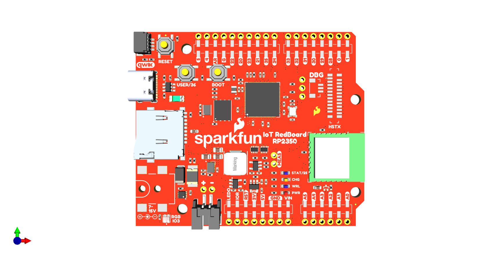
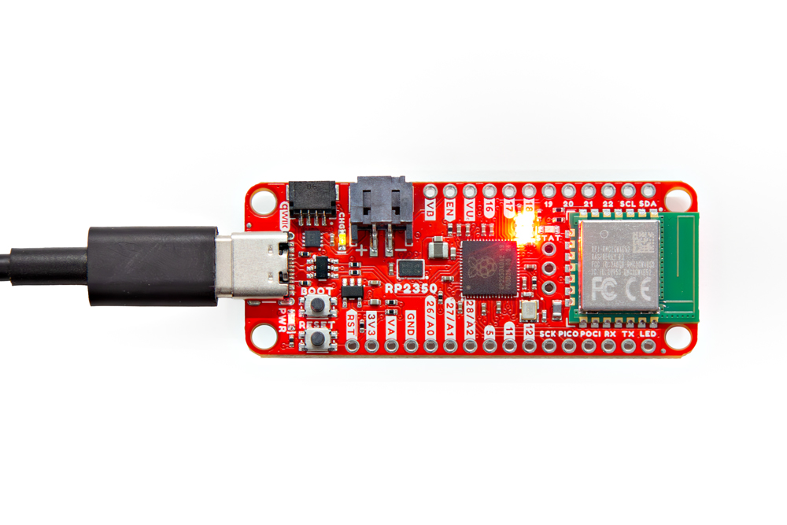
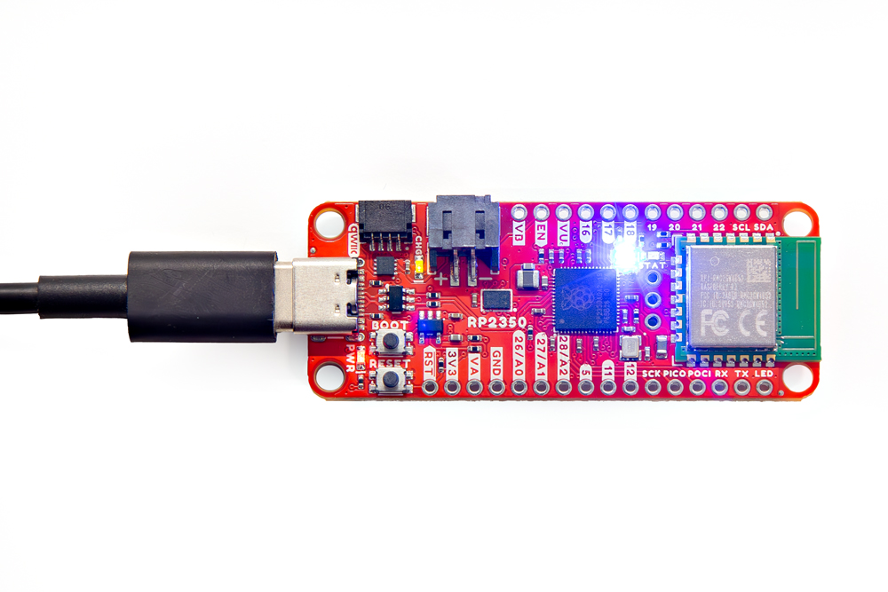
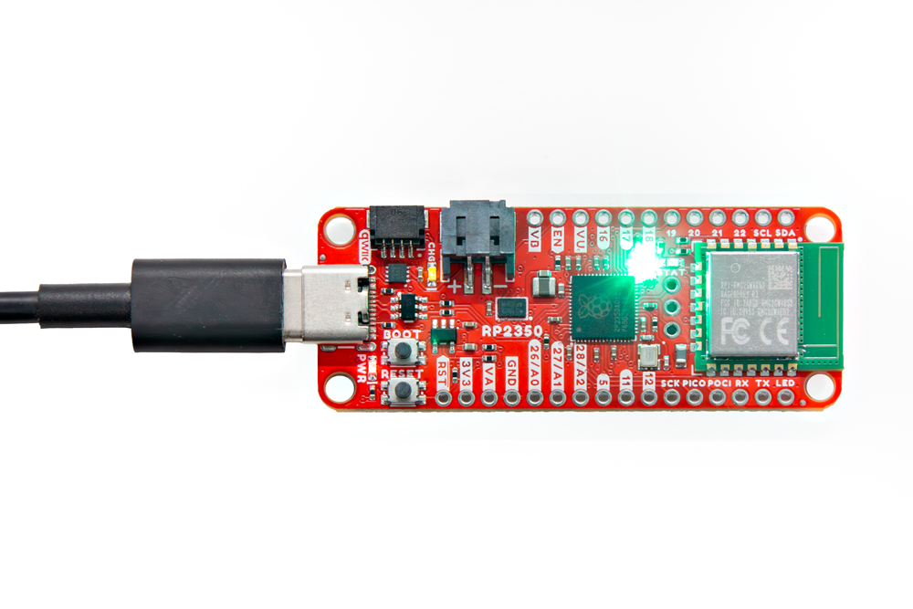

Welcome to the SparkFun IoT RedBoard - RP2350 Quick Start Guide. This streamlined version of our standard Hookup Guides assumes a working knowledge of how to use a development board and the required software to program them for your project's needs. It covers a quick assembly and then jumps right into getting the necessary software packages installed to start uploading code in just a few short minutes. The document finishes with simple examples for each development environment showing how to set up and use the RM2 wireless chip to connect to a WiFi network.

If you're not familiar with using development boards or the development environments covered in this guide, refer to the Hardware & Software sections for a detailed overview of the board along with instructions on setting up and programming the IoT RedBoard - RP2350.


## Basic Assembly

Start by plugging the IoT RedBoard - RP2350 into your computer using a USB-C connector. 

<figure markdown>
[{ width="600" }](./assets/img/SparkFun_IoT_RedBoard-RP2350.jpg "Click to enlarge")
</figure>


## Software Examples

Next up we'll cover how to upload to the IoT RedBoard - RP2350 using preferred development environment(s). If you're using any peripherals (Qwiic boards, shields, etc.) connect those now or after installing the necessary software and board packages.

The following examples all complete the same task of connecting the IoT RedBoard - RP2350 to a WiFi network and pinging a site. They also include a visual indicator of the connection status using the RGB LED on the board like the photos below show:

<div class="grid cards hide col-4" markdown align="center">

-	<figure markdown>
	[{ width="600"}](./assets/img/Thing_Plus_RP2350-RED.jpg "Click to enlarge")
	<fig caption>LED set to <b>RED</b> while connecting to WiFi.</fig caption>
	</figure>

-	<figure markdown>
	[{ width="600"}](./assets/img/Thing_Plus_RP2350-BLUE.jpg "Click to enlarge")
	<fig caption>LED set to <b>BLUE</b> while downloading.</fig caption>
	</figure>

-	<figure markdown>
	[{ width="600"}](./assets/img/Thing_Plus_RP2350-GREEN.jpg "Click to enlarge")
	<fig caption>LED set to <b>GREEN</b> indicating download success.</fig caption>
	</figure>
</div>

### Raspberry Pi Pico SDK

The IoT RedBoard - RP2350 is supported in **version needed - ML** of the Pico SDK. The Pico SDK works great in [Microsoft VS Code](https://code.visualstudio.com/) with the [Pico SDK Extension](https://marketplace.visualstudio.com/items?itemName=raspberry-pi.raspberry-pi-pico). Upload to the board by selecting `sparkfun_redboard_rp2350`.

**Insert example code - ML**


### MicroPython

The IoT RedBoard - RP2350 has Beta releases of MicroPython firmware available [here](https://github.com/sparkfun/micropython/releases). Download and install the MicroPython firmware onto your IoT RedBoard - RP2350, open your preferred Python IDE (or CLI) and copy the code below into it:

**Code to Note**:
LED control. Values are (R,G,B) 0-255. This sets the LED to full Red.
``` py
led[0] = (255, 0, 0)
led.write()
```
WiFi network connection. Enter values for network ID and password.

```py
wlan = network.WLAN(network.STA_IF)
wlan.active(True)
wlan.connect('WIFI_NETWORK', 'WIFI_PASSWORD')
```

``` py
import network
import urequests
import time
import neopixel
import machine

# Set up the NeoPixel LED
pin = machine.Pin("NEOPIXEL")
led = neopixel.NeoPixel(pin, 1)

# Set the LED to red while connecting to WiFi
led[0] = (255, 0, 0)
led.write()

# Connect to a WiFi network
wlan = network.WLAN(network.STA_IF)
wlan.active(True)
wlan.connect('WIFI_NETWORK', 'WIFI_PASSWORD')

# Wait for the connection to complete
print("Waiting for connection...")
while not wlan.isconnected():
	time.sleep(1)
	print('.', sep='', end='', )
print('Connected!')

# Set the LED to blue while downloading data
led[0] = (0, 0, 255)
led.write()

# Download the list of astronauts currently in space
print('Downloading list of astronauts currently in space...')
astronauts = urequests.get("https://corquaid.github.io/international-space-station-APIs/JSON/people-in-space.json").json()

# Print the number of astronauts and their names
number = astronauts['number']
print('There are', number, 'astronauts in space.')
for i in range(number):
    print(i+1, astronauts['people'][i]['name'])

# Set the LED to green to indicate success
led[0] = (0, 255, 0)
led.write()

```


### Arduino IDE

The IoT RedBoard - RP2350 board definition is included in the [Arduino-Pico](https://github.com/earlephilhower/arduino-pico) boards package. Install or update to the latest Arduino-Pico release and select `SparkFun IoT RedBoard - RP2350` as your board. This example also uses the [Neopixel Arduino library]((https://github.com/adafruit/Adafruit_NeoPixel)) to control the WS2812 RGB LED.

## Going Further

If you're looking for more detailed information on the design and components on this IoT Redboard, read on to the Hardware section below. Similarly, the Software tab includes detailed instructions on installing and using all supported development environments along with a few more examples for each IDE. Finally, the Resources section includes the board design files and datasheets for major components on the board.